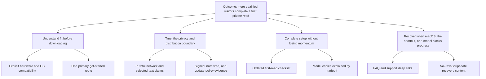

# MLXRead Website Delivery Authority

Status: release candidate, awaiting exact-tree proof, merge, deployment, and production readback

Scope: public website, first-read journey, Cloudflare Pages release, and `mlxread.com` cutover

Evidence mode: product-source inference; no customer interviews, analytics, or completed OKR cycle

## Decision

Ship the existing focused Leptos website after truth, security, and release gates. Do not spend the launch window on another broad visual redesign. The binding constraint is the governed Cloudflare Pages upload and domain lifecycle, not interface quality.

The full five-day design sprint is not ready or proportionate: the challenge is already implemented, no decider/roster calendar is committed, and five target users have not been recruited. Replace it with five moderated download-to-first-read observations after launch.

## Source ledger

| ID | Operator direction | Delivery interpretation |
|---|---|---|
| S1 | “spearhead to prod” | Complete source, proof, deploy, and live readback rather than stopping at recommendations. |
| S2 | “update the website” | Correct material launch gaps in the current implementation. |
| S3 | “de-template it, make it beautiful” | Remove starter language and preserve the accepted graphite/amber product expression. |
| S4 | “leptos router, cargo-leptos” | Keep routes in Leptos Router and release through the repository Cargo Leptos build. |
| S5 | “mlxread.com” | Treat the custom hostname as the canonical production surface. |
| S6 | “tie it together” | Bind product intent, source, security, deployment, and runtime evidence. |
| S7 | “use cfctl” | Use cfctl plan, approval, execution, and verification for every Cloudflare mutation. |

## Persona

### Primary persona: the privacy-sensitive Mac reader

- Mode: product persona.
- Stage: proto/directional.
- Confidence: low, because this is derived from product behavior and operator direction rather than interviews.
- Context: uses an Apple Silicon Mac and reads in Safari, Notes, Xcode, PDFs, or other selectable-text surfaces.
- Job: hear selected text without sending the text to a remote speech service.
- Desired progress: decide whether MLXRead fits, install a signed build, grant only required macOS access, choose a model, and complete a first read without guessing.
- Pain: built-in speech may sound insufficient; cloud readers create privacy ambiguity; macOS permission and model setup can interrupt momentum.
- Decision criteria: local synthesis, explicit compatibility, signed/notarized distribution, fast stopping, plain-language recovery.
- Objections: “Does my text leave the Mac?”, “Will this work on my hardware?”, “Why does macOS need permission?”, and “What happens if the shortcut does nothing?”
- Anti-persona: a visitor seeking iOS, Windows, Intel Mac, account syncing, cloud narration, or team administration.

Evidence: `README.md`, `docs/privacy.md`, `website/src/components/home_page.rs`, and `website/src/components/get_started_page.rs`. No verbatim customer quote is available; none is invented.

## Opportunity solution tree

The current website implements these solution branches. The next experiment is observational, not another speculative feature: watch five target users move from the home page through their first successful read and record where they hesitate, abandon, or request help.

## Market-sizing decision

No defensible TAM/SAM/SOM number is asserted. The repository contains no price, conversion baseline, addressable-device count, acquisition channel data, or validated willingness-to-pay input. A broad “Mac users” top-down number would create false precision and does not change the release decision.

The useful near-term market unit is behavioral: qualified Apple Silicon Mac visitors who need local selected-text speech. After launch, measure qualified visits, get-started progression, download intent, support topics, and first-read success from consented research. Revisit monetary sizing only when distribution and pricing strategy exist.

## OKR

Objective: Make MLXRead’s public path a trustworthy bridge from curiosity to a successful first local read.

| Key result | Baseline | Initial target | Measurement status |
|---|---:|---:|---|
| Qualified visitors who reach `/get-started` after viewing product or privacy evidence | unknown | establish baseline for the first 30 days | not instrumented |
| Moderated target users who complete download-to-first-read without facilitator correction | unknown | at least 4 of 5 | research not recruited |
| First-read participants who can correctly explain whether selected text leaves the Mac | unknown | 5 of 5 | research not recruited |
| Canonical route contract passing on `mlxread.com` for all documented routes, 404 behavior, TLS, and security/cache headers | 0 live canonical routes | 100% at launch | release gate |
| Material privacy or distribution claims contradicted by source behavior | at least 1 pre-launch overstatement found | 0 at launch | source review gate |

The objective is empowering, but empowerment evidence is not yet observable. The OKR grader therefore returns **not gradable** rather than inventing a score: the cycle has not run, baselines are absent, and three outcome KRs require research or instrumentation. The route and claim KRs are launch gates, not proof of customer outcome.

## Build-risk review

Mode: feature-change review of “further visual redesign before production.”

| Risk | Evidence | Confidence | Response |
|---|---|---|---|
| Demand/fit: another beauty pass may solve no observed visitor problem | no visitor research or analytics; current rendered surface is coherent and product-specific | medium | build small: ship correctness and trust fixes only |
| Trust: absolute network and speed copy can exceed actual behavior | source includes updates, pronunciation assets, support network use, and model-specific timing | high | qualify claims before deploy |
| Release: Pages upload/domain mutations previously lacked an executable required control-plane contract | cfctl catalog blocker was reproduced; current contracts are ready | high | retain cfctl plan/apply/readback proof as the release gate |
| Security: website, support worker, update path, and local app boundaries required owner confirmation | operator approved the bounded production pass; policy and threat model now cover canonical-domain and DMG/ZIP boundaries | medium | verify the approved source diff before merge |
| Measurement: a launch can be “green” while first-read friction remains unknown | no product analytics or moderated study | high | schedule five post-launch observations |

Verdict: **build small and release**. Further visual polish is demand level L0/L1; the domain and deployment path are release necessities.

## Prioritized action plan

Cynefin domain: complicated. Complexity: medium-high. Binding constraint: cfctl’s previously incomplete Pages upload/domain contracts.

| Priority | Action | Owner | Proof | Stop condition |
|---|---|---|---|---|
| P1 | Close and verify exact cfctl Pages upload/domain contracts | control-plane lane | `cargo xtask verify`, live-schema catalog read | both capabilities executable with exact verification |
| P2 | Correct overbroad claims and tracked template doctrine | website lane | source diff, tests, rendered review | no known contradictory material claim or starter authority remains tracked |
| P3 | Confirm security assumptions; update policy/threat model only after owner approval | operator + website lane | approved diff and repository-grounded model | trust boundaries and reportable issues are explicit |
| P4 | Run exact-tree website release gate and build Pages artifact | website lane | `website/scripts/verify.sh`, artifact manifest | exact committed source SHA has a fresh passing artifact |
| P5 | Plan, approve, and run Pages upload and domain attachment through cfctl | operator authority + control plane | plan IDs, apply receipts, post-change verification | exact SHA is production and domain resource exists |
| P6 | Prove canonical runtime contract | website lane | DNS/TLS, route/status/content/header readback | `mlxread.com` passes every acceptance criterion |
| P7 | Observe five first-read journeys and grade the OKR when actuals exist | product lane | research notes and KR actuals | evidence supports retain/refine decision |

## User stories

1. As a privacy-sensitive Apple Silicon Mac user, I want to understand fit and data flow before downloading so I can decide without exposing selected text.
2. As a new user, I want one ordered path from download through the first read so I do not have to infer macOS permissions, model choice, or shortcut behavior.
3. As a visitor following a deep link, I want every documented route to render directly and preserve meaningful browser navigation so the website behaves like a real multipage product surface.
4. As a blocked user, I want FAQ and support recovery that works without JavaScript so setup failure does not become abandonment.
5. As the release operator, I want the exact source SHA bound to the Pages deployment and custom domain so command success cannot be mistaken for production proof.

## Hypothesis journey map

All behavior and emotion below is a low-confidence hypothesis until moderated research occurs.

| Stage | User goal and action | Likely question/emotion | Product response | Evidence to collect |
|---|---|---|---|---|
| Discover | decide whether this is a better Speak Selection | curious, skeptical | concise local-reader promise and compatibility | entry source, comprehension |
| Verify fit and trust | inspect privacy, speed, signing, hardware | cautious | bounded claims, privacy boundary, measured model-specific numbers | claim recall, objections |
| Download | obtain the current signed release | alert to malware and compatibility | canonical get-started route and release link | click intent, abandonment reason |
| Grant access | enable required macOS permission | uneasy about scope | explain why permission is needed and how to recover | permission failure rate |
| Choose model | trade voice breadth for speed | uncertain | Kokoro/Soprano comparison without a fake default | choice rationale |
| First read | select text and press the shortcut | expectant | explicit shortcut and stop behavior | time to first audio, corrections |
| Recover/return | fix no-audio, permission, or model issues | frustrated but salvageable | FAQ, support, and immediate stop guidance | support topic and resolution |

## Acceptance criteria

- Given any documented route, when requested directly over HTTPS, then it returns its intended content and a successful status; an unknown route returns the product 404 with HTTP 404.
- Given client-side navigation, when a visitor uses route links and browser back/forward, then Leptos Router preserves the expected URL, title, focus-visible controls, and content.
- Given a visitor without JavaScript, when they open product, get-started, FAQ, support, privacy, or terms, then the essential content and recovery path remain available.
- Given the home page, when privacy and performance claims render, then selected-text behavior is distinguished from asset, update, and support network traffic, and measured latency is model/warm-state qualified.
- Given a person selecting the public macOS download, when they follow the primary release action, then they receive `MLXRead.dmg`; Sparkle continues to receive the separately signed `MLXRead.zip` update archive.
- Given a narrow viewport at 390 CSS pixels and a desktop viewport at 1440 CSS pixels, when pages render, then no horizontal overflow, clipped action, or unreachable navigation is present.
- Given a keyboard-only visitor, when they traverse navigation, demo controls, forms, and links, then focus is visible, order is logical, landmarks/headings are coherent, and interactive elements have accessible names.
- Given support submission, when the request is cross-origin or exceeds the body limit, then it is rejected without forwarding; same-origin valid requests receive private, non-cacheable handling.
- Given immutable hashed assets, when requested, then they receive immutable caching; documents revalidate; API responses are private and `no-store`.
- Given the reviewed release source SHA, when cfctl completes the Pages plan, then the production deployment readback reports the exact project, branch, SHA, and successful stage.
- Given `mlxread.com`, when DNS and TLS converge, then all route/status/content/header checks pass on the canonical host and no release claim relies only on the Pages resource receipt.

## Design-sprint readiness

Decision: **wait / do not schedule the five-day sprint**.

- Challenge: clear and already implemented.
- Decider: operator role is clear; no named calendar commitment.
- Team: no committed 4–7 person sprint roster.
- Research: no five target participants recruited.
- Prototype: production-capable implementation already exists, making a disposable prototype wasteful.
- Better next move: launch the bounded experience, then run five moderated first-read sessions and use observed friction to decide whether a focused sprint is warranted.

## Launch checklist

Launch type: public website production cutover. Target: first day after all blockers close.

- [x] Product routes and router fallback implemented.
- [x] De-templated visual and tracked product doctrine present.
- [x] Material network/performance copy corrected in source.
- [x] Exact cfctl Pages/domain contracts locally verified against the current schema.
- [x] Security assumptions confirmed by the operator.
- [x] Exact security-policy diff approved before write.
- [x] Threat model refreshed after assumption confirmation.
- [ ] Website full release gate passes on the final committed source tree.
- [ ] Release source committed and available on the intended branch.
- [ ] Pages artifact plan reviewed and approved by exact operation ID.
- [ ] Pages apply and exact-SHA production readback pass.
- [ ] Custom-domain plan reviewed and approved by exact operation ID.
- [ ] Domain resource readback, DNS, TLS, canonical routes, 404, content, and headers pass.
- [ ] Rollback target identified as a known prior deployment/artifact; any rollback remains a separate reviewed plan.
- [ ] Five moderated first-read observations scheduled; OKR grading deferred until actuals exist.

Go/no-go: no-go while any unchecked security, exact-tree, control-plane, or live-host item remains. A local build, resource creation receipt, or Pages URL alone is not launch completion.
