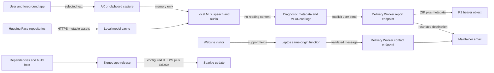

# MLXRead Threat Model

_Repository: `mlxread`; owner-confirmed assumptions refreshed 2026-08-05._

## 1. Executive summary

MLXRead has one crown-jewel privacy invariant: selected and spoken text must
stay on the user's Mac. The app nevertheless has legitimate network paths for
model/pronunciation assets, configured updates, user-initiated problem reports,
and the public website's support form. Security depends on keeping reading
content structurally separate from those paths.

The highest-value residual risks are:

1. a logging or report-bundle regression that copies reading content into a
   networked payload;
2. disclosure or indefinite retention of a diagnostic ZIP whose random
   download URL acts as its only authorization;
3. model and pronunciation assets accepted from mutable upstream state without
   a shipped digest manifest;
4. release/update misconfiguration or build-host compromise; and
5. abuse of unauthenticated support/report endpoints whose throttles are
   intentionally best-effort.

The checked local `dist/MLXRead.app` is Developer ID-signed, hardened,
notarized, and stapled. The public GitHub v0.1.0 release currently has a
downloadable ZIP with a published SHA-256 digest; the production release path
now builds a separately notarized and stapled DMG for manual installation while
retaining the ZIP for Sparkle. Those facts are artifact/distribution evidence,
not proof that the checked-in Sparkle update channel is active: the
repository's `SUFeedURL`, public key, and `appcast.xml` remain placeholders, and
`UpdateService` deliberately stays inactive in that state.

## 2. Scope and assumptions

### In scope

- The macOS app: event tap, Accessibility selection capture, clipboard
  fallback, in-memory speech pipeline, model cache, diagnostics, and reporting.
- The public, unauthenticated Leptos website intended for `mlxread.com`, its
  same-origin server-function surface, and the temporary Pages compatibility
  hostname.
- The public delivery Worker: `/contact`, `/report`, `/d/:id`, `/health`, KV
  rate limits, Email Routing binding, and R2 report storage.
- Developer ID signing, notarization, Sparkle, the appcast, release publishing,
  SPM dependencies, build plugins/macros, and model/G2P acquisition.

### Out of scope

- Third-party implementation defects without demonstrated MLXRead reachability.
- The internal security of Apple, GitHub, Hugging Face, and Cloudflare, while
  still treating each as a trust boundary.
- Attacks that already control root or an administrator account and cross no
  additional MLXRead boundary.
- Speech quality and model-output correctness unless they create a security or
  privacy impact.

### Confirmed assumptions

- A1. `mlxread.com`, the support/report Worker, a signed macOS app, and its
  update path are public surfaces. There are no accounts or tenants.
- A2. Selected and spoken text is highly sensitive and forbidden from website,
  support, report, storage, and logging paths.
- A3. Reporter-entered email/message/description and enumerated privacy-safe
  diagnostic metadata are permitted data.
- A4. Same-user unprivileged processes, local privilege escalation, and
  signing/update bypass are in scope; an already-root/admin adversary is not.
- A5. macOS 14+ on Apple Silicon is the supported app environment, and users
  intentionally grant Accessibility access.
- A6. Source intent, local artifact proof, deployment, and live readback are
  separate evidence planes.

### Open decisions that affect risk

- O1. R2 report objects have no deletion/retention rule visible in source.
- O2. Report download URLs are bearer capabilities; there is no authenticated
  maintainer identity in front of `/d/:id`.
- O3. Model/G2P assets are not verified against a repository-owned digest
  manifest.
- O4. The checked-in Sparkle feed remains intentionally inactive until real
  release-specific feed, key, archive length, URL, and signature values exist.

## 3. System model

### Components

- **App shell and settings** — owns lifecycle, user preferences, model state,
  Accessibility state, and the report UI.
- **Capture boundary** — `CGEventTap`, AX selection read, and a general
  pasteboard fallback with `changeCount`-guarded restoration.
- **Local speech path** — normalization, chunking, MLX inference, and local
  audio playback; reading content should remain inside this path.
- **Asset path** — Hugging Face model/G2P downloads into the app's local cache.
- **Update path** — Sparkle over HTTPS with EdDSA verification, but only after
  release-specific configuration passes the placeholder guard.
- **Leptos website** — stateless pages plus same-origin server functions;
  security headers include a CSP, frame denial, no-sniff, and referrer policy.
- **Delivery Worker** — validates support/report inputs, rate-limits on KV,
  sends only to the configured maintainer, and stores report ZIPs in R2.
- **Build/release path** — XcodeGen, pinned Swift packages, build
  plugins/macros, Developer ID signing, Apple notarization, GitHub release, and
  Cloudflare deployment.

### Data flows and trust boundaries

Boundary notes:

- The clipboard fallback briefly places reading content on the general
  pasteboard, which same-user software can observe.
- `APP_TOKEN` ships in the app binary and is not a secret; it is only a
  low-friction abuse signal alongside size and rate controls.
- Contact submissions proxied by the site Worker share the proxy's network
  identity, so the API throttles contact by normalized sender email.
- R2 identifiers are 128-bit random values. Entropy makes guessing unlikely,
  but possession of a URL is sufficient to retrieve its bundle.
- The site has no account, cookie, analytics, or tenancy boundary.

## 4. Assets and security objectives

| Asset | Objective | Why it matters |
|---|---|---|
| Selected/spoken text | Confidentiality | May contain credentials, legal, medical, or financial material |
| General pasteboard snapshot | Confidentiality and integrity | Fallback must not leak or corrupt unrelated clipboard data |
| Accessibility and event-tap grant | Integrity | It can observe selections and global key events |
| Diagnostic ZIP and support content | Confidentiality and integrity | Contains user-entered content, device/app metadata, logs, and IP metadata |
| R2 bearer URL | Confidentiality | It is the sole access capability for a stored report |
| Model/G2P cache | Integrity | Unverified assets drive in-process parsing and speech behavior |
| Signed app, installer DMG, Sparkle ZIP, update key, and appcast | Authenticity and integrity | Compromise can distribute a privileged look-alike or malicious update |
| Build host and dependency pins | Integrity | They determine what receives the trusted signature |
| Website/Worker availability | Availability | Abuse can suppress support or create delivery cost/noise |

## 5. Attacker model

### Capabilities

- An unauthenticated internet client can call public website and Worker routes,
  forge user-entered fields, replay the non-secret app token, and distribute a
  leaked report URL.
- A same-user unprivileged process can observe the general pasteboard, attempt
  debugger/task-port attachment, influence a development process environment,
  and read user-readable model-cache files.
- A compromised model repository or trusted TLS endpoint can change mutable
  model/G2P assets.
- A malicious or compromised dependency/build host can run code during a
  release build and attempt to steal signing material or alter the artifact.
- A release-channel attacker may control a feed host but not the maintainer's
  Ed25519 private key.

### Non-capabilities and constraints

- The app exposes no inbound listener; remote app compromise must enter through
  an outbound asset/update parser or a distribution path.
- Release hardened runtime and absent `get-task-allow` materially constrain
  same-user task-port attachment; Debug builds intentionally do not prove this.
- Sparkle rejects an unsigned update when a real public key is configured.
- The Worker email binding can send only to the configured maintainer, limiting
  open-relay impact.
- Random report IDs are impractical to brute-force at 128 bits; disclosure is
  more likely through logs, email, browser history, forwarding, or maintainer
  endpoint compromise.

## 6. Entry points and attack surfaces

| Surface | Boundary | Existing controls | Residual concern |
|---|---|---|---|
| Option–Escape event tap | Global keyboard → app | Narrow callback and trust-revocation handling | Repackaged or compromised app could widen behavior |
| AX selection capture | Foreground app → app memory | Accessibility consent and bounded capture | Core high-sensitivity data enters process memory |
| Clipboard fallback | App ↔ general pasteboard | Snapshot plus race-aware restore | Same-user clipboard observers can see temporary selection |
| Model/G2P download | Hugging Face → local cache | HTTPS, safetensors requirement, structural checks | Mutable upstream state; no shipped digest manifest |
| Sparkle feed/archive | GitHub/HTTPS → updater | Placeholder guard and EdDSA verification | Checked-in feed inactive; release config/key custody remains critical |
| Website `/api/*` | Browser → Leptos Worker | Same-origin policy, methods/types/body limit, CSP | No identity; direct API Worker remains public |
| API `/contact` | Internet/site proxy → email | Validation, honeypot, KV throttle, restricted recipient | Email-key throttling is gameable and KV increments are non-atomic |
| API `/report` | App/internet → R2/email | Non-secret token, size cap, IP throttle, restricted recipient | Token replay; free-form description; ZIP content trusted from client |
| API `/d/:id` | Bearer URL → R2 object | Random 128-bit ID and `private, no-store` | No authenticated maintainer gate or visible expiry |
| Build and release | Dependencies/build host → signed app, DMG, and update ZIP | Pin file, Developer ID, app and DMG notarization/stapling, GitHub digest | Validation-skip flags and signing-key exposure on build host |

## 7. Top abuse paths

1. **Reading-content privacy regression:** a future log statement, exception,
   report field, or automatic form population includes selection text → user
   sends a report → Worker stores/emails the content. This crosses the core
   promise despite every network component functioning as designed.
2. **Report disclosure:** a diagnostic ZIP is submitted → bearer URL appears in
   email/history/logging → a recipient forwards or loses the URL → another
   party downloads the ZIP; no expiry or authenticated gate limits the window.
3. **Unauthenticated endpoint abuse:** an attacker copies the app token or calls
   `/contact` directly → rotates emails/IPs or races KV increments → generates
   maintainer mail, R2 objects, and operational cost/noise.
4. **Model substitution:** an upstream repo or trusted endpoint changes a
   mutable model/G2P asset → the app accepts structural validity without a
   repository-owned digest → altered data reaches an in-process parser/model.
5. **Release compromise:** a dependency/plugin or build-host adversary tampers
   before signing or steals signing/update keys → users receive an artifact
   that can exploit the Accessibility grant. Notarization and EdDSA help only
   when their keys and signing inputs remain trustworthy.
6. **Clipboard observation:** an app without usable AX selection triggers the
   Command-C fallback → a clipboard manager reads the temporary selection before
   restoration → local confidentiality is lost without any MLXRead network use.

## 8. Threat table

| ID | Threat source and prerequisites | Action and impact | Existing controls | Gaps and recommended mitigation | Detection | Likelihood | Severity | Priority |
|---|---|---|---|---|---|---|---|---|
| TM-001 | Code regression; user sends report | Selected/spoken text enters logs, description, ZIP, support payload, R2, or email | Capture is not read by `DebugBundle`; `AppLogger` invariant; UI disclosure; source comments | Add automated content-canary tests across logs, generated ZIP, multipart body, and Worker fixtures; reject any automatic reading-content field | Privacy regression test and sampled bundle schema audit | Low | High | **High** |
| TM-002 | Bearer URL leak after a report exists | Unauthorized diagnostic ZIP download; long-lived metadata/content exposure | 128-bit random ID; no listing route; `private, no-store` | Put `/d/*` behind maintainer authentication or issue one-time/expiring signed capabilities; define and enforce R2 lifecycle deletion | Access logs keyed by object ID; deletion receipts | Medium | High | **High** |
| TM-003 | Unauthenticated client; copied app token; many IPs/emails | Mail/R2 abuse, support denial, cost and alert fatigue | Input/size caps, honeypot, best-effort KV throttles, restricted email destination | Treat app token as public; use atomic rate limiting/bot defense and route-specific quotas; bound R2 writes | 429/error ratios, R2 object rate, email-volume alerts | Medium | Medium | **Medium** |
| TM-004 | Compromised mutable model/G2P upstream or trusted TLS endpoint | Altered assets accepted into cache and parsed in-process | HTTPS/ATS; safetensors extension and non-empty/config JSON checks | Pin immutable revisions and verify every file against a shipped digest manifest before activation | Record expected/actual digests without content; fail closed on mismatch | Low | High | **High** |
| TM-005 | Feed/build misconfiguration or release-key compromise | Malicious or unavailable update/distribution channel | Placeholder guard; HTTPS; Sparkle EdDSA; Developer ID; hardened runtime; app and DMG notarization/stapling; GitHub asset digest | Replace templates only in a controlled release transaction; keep update private key off repo and least-privileged; verify the manual-install DMG and Sparkle archive independently | Release receipt covering code signature, app and DMG notarization, both asset digests, appcast signature, and live fetch | Low | High | **High** |
| TM-006 | Malicious dependency, plugin/macro, or compromised build host | Tamper with signed app or steal signing material | Swift package pins, Apple signing/notarization | Release scripts skip plugin/macro validation; isolate release host, review pin/plugin changes, avoid validation bypass for release, use short-lived credentials | Dependency diff gate, build provenance, key-use alerts | Low | High | **Medium** |
| TM-007 | Same-user clipboard observer; fallback required | Reads temporary selected text from general pasteboard | AX first; bounded fallback; `changeCount`-safe restoration; user can disable fallback | Document residual risk; consider per-app fallback consent/deny list and minimize exposure window | Count fallback use without content; user-visible fallback indicator | Medium | Medium | **Medium** |
| TM-008 | Same-user process targeting Debug or mis-signed artifact | Attach/debug and read process memory | Public local artifact is Developer ID-signed, hardened, notarized, stapled, with no release `get-task-allow` | Make release gate fail if hardened runtime/notarization/entitlements differ; never distribute Debug builds | `codesign`, `spctl`, stapler, and entitlement checks bound to release digest | Low | High | **Medium** |
| TM-009 | Cross-origin client or oversized/unsupported server-function request | CSRF-like submission, parser/resource abuse, or header-policy bypass | Same-origin/Sec-Fetch policy, POST content-type allowlist, 4 KiB body cap, CSP, frame denial, no cookies | Retain tests for missing/spoofed forwarding headers and deployed proxy behavior; remember direct delivery Worker endpoints are separately public | Synthetic route probes and edge error-rate alerts | Low | Medium | **Medium** |

## 9. Criticality calibration

- **Critical:** remotely triggered code execution or silent selected-text
  exfiltration at scale without prior local execution. No confirmed path exists.
- **High:** a practical violation of the reading-content invariant, unauthorized
  diagnostic-bundle disclosure, malicious signed/update distribution, or
  in-process asset parser compromise.
- **Medium:** bounded endpoint abuse, same-user clipboard observation,
  distribution hardening regression with additional prerequisites, or support
  availability/cost impact.
- **Low:** self-recovering local availability failures with no privacy or
  integrity consequence.

Priority combines likelihood, impact, and the leverage of the control; it is
not a generic CVSS score.

## 10. Focus paths for security review

| Path | Review focus | Threats |
|---|---|---|
| `MLXRead/Reporting/DebugBundle.swift` | Enumerated bundle schema and log-content invariant | TM-001, TM-002 |
| `MLXRead/Reporting/ReportSender.swift` | Free-form fields, multipart construction, endpoint contract | TM-001, TM-003 |
| `MLXRead/Support/AppLogger.swift` and all call sites | No selected/spoken text or derived reversible content | TM-001 |
| `api/src/index.js` | Public-route authorization, rate limiting, R2 lifecycle, bearer download | TM-002, TM-003 |
| `api/wrangler.jsonc` | Canonical origin, least-privilege bindings, observability data | TM-003, TM-009 |
| `website/src/lib.rs` and generated Pages Worker | Same-origin/body policy, CSP, proxy behavior | TM-009 |
| `MLXRead/Models/ModelStore.swift` and dependency model resolver | Immutable revisions and digest verification | TM-004 |
| `project.yml`, `appcast.xml`, `MLXRead/Updates/UpdateService.swift` | Fail-closed update activation and release-specific authority | TM-005 |
| `script/package.sh`, `script/notarize.sh`, `Package.resolved` | Build-host execution, signature/notarization proof, key custody | TM-005, TM-006, TM-008 |
| `MLXRead/Accessibility/ClipboardSelectionReader.swift` | Exposure window and restoration correctness | TM-007 |

## 11. Quality check

- Public website, server functions, delivery Worker, app reporting, R2, update,
  asset download, local capture, and build/release entry points are covered.
- Runtime, public-service, and build/release threats are separated.
- No mitigation is credited beyond source evidence or the checked local/public
  artifact evidence; deployment and live readback remain distinct.
- The “no accounts” boundary does not erase support/report user data.
- Root/admin compromise is excluded narrowly; same-user attacks, local
  privilege escalation, and update/signing bypass remain in scope.
- Highest-priority recommendations preserve the product invariant without
  weakening controls, deleting tests, or treating documentation as remediation.
